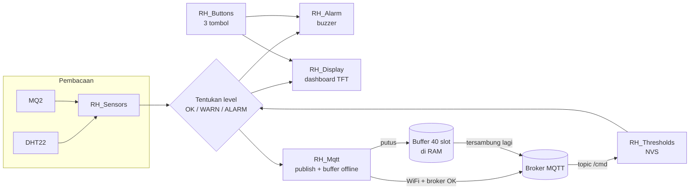
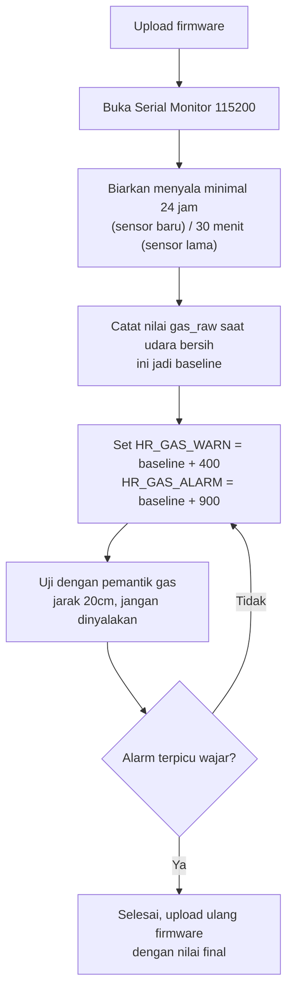

# RH_ServerRoomMonitor

Firmware ESP32 Dev Module untuk monitoring ruang server: DHT22 (suhu &
kelembapan), MQ2 (gas/asap), buzzer alarm, 3 tombol panel, dan dashboard
di TFT 3.5" 480×320 (SPI langsung). Data dikirim via MQTT ke broker lokal,
dengan buffer offline saat WiFi/MQTT putus.

Dikembangkan oleh tim **Automation Engineer** untuk **PT Riau Sakti United
Plantations – Industry**.

---

## Daftar isi

1. [Yang wajib dikerjakan sebelum upload](#1-yang-wajib-dikerjakan-sebelum-upload)
2. [Wiring](#2-wiring)
3. [Library yang dibutuhkan](#3-library-yang-dibutuhkan)
4. [Struktur file](#4-struktur-file)
5. [Arsitektur & alur kerja firmware](#5-arsitektur--alur-kerja-firmware)
6. [Fungsi tombol](#6-fungsi-tombol--masih-sementara)
7. [Format data MQTT](#7-format-data-mqtt)
8. [Kalibrasi MQ2](#8-kalibrasi-mq2)
9. [Ambang batas (threshold) awal](#9-ambang-batas-threshold-awal)
10. [Tampilan dashboard](#10-tampilan-dashboard)
11. [Mengganti logo](#11-mengganti-logo)
12. [Troubleshooting umum](#12-troubleshooting-umum)
13. [Riwayat perubahan](#13-riwayat-perubahan)

---

## 1. Yang WAJIB dikerjakan sebelum upload

### a. Rakit wiring sesuai dokumen

Jangan sambung semua komponen sekaligus tanpa panduan — lihat:

- **`RH_WIRING_DISPLAY.md`** — khusus layar TFT (pin, urutan init, troubleshooting layar)
- **`RH_WIRING_FULL.md`** — seluruh sistem: display + DHT22 + MQ2 + buzzer + 3 tombol, termasuk rangkaian pendukung wajib (pembagi tegangan, pull-up)

Ringkasan dua rangkaian pendukung yang **wajib** ada, detail lengkap ada di `RH_WIRING_FULL.md` §3:

- Pembagi tegangan 10kΩ/20kΩ di jalur MQ2 AO → GPIO33 (tanpa ini ADC ESP32 berisiko rusak)
- Pull-up eksternal 10kΩ di GPIO35 dan GPIO34 untuk tombol 2 & 3 (pin ini tidak punya pull-up internal)

### b. Install library "Adafruit GFX Library"

Library Manager Arduino IDE → cari **Adafruit GFX Library** → Install. Kalau
IDE menawarkan **Adafruit BusIO**, pilih *Install all*.

Tidak ada langkah menimpa `User_Setup.h` di folder library. **TFT_eSPI
tidak dipakai** — kalau masih terpasang dari proyek lain, biarkan saja,
tidak mengganggu.

### c. Isi kredensial

Di `RH_Config.h`, ganti nilai berikut sebelum upload:

| Konstanta | Isi dengan |
|---|---|
| `HR_WIFI_SSID` | nama WiFi lokasi |
| `HR_WIFI_PASS` | password WiFi |
| `HR_MQTT_HOST` | IP broker Mosquitto |

File ini berisi kredensial dalam bentuk teks polos — jangan unggah ke
repository publik tanpa menghapus/mengganti nilainya.

---

## 2. Wiring

Wiring dipecah jadi dua dokumen terpisah supaya masing-masing tetap
ringkas dan mudah dicari:

| Dokumen | Isi |
|---|---|
| **`RH_WIRING_DISPLAY.md`** | Wiring TFT 3.5" 480×320 ke ESP32: kenapa cuma 5 pin data, tabel pin, diagram, urutan init, backlight, troubleshooting layar |
| **`RH_WIRING_FULL.md`** | Wiring seluruh sistem: peta pin lengkap, diagram sistem, rangkaian pendukung (pembagi tegangan MQ2, pull-up tombol), total kebutuhan daya, urutan perakitan yang disarankan |

Ringkasan peta pin (detail & alasan ada di dua dokumen di atas):

| Komponen | GPIO ESP32 |
|---|---|
| TFT CS / DC / RST / SCLK / MOSI | 5 / 2 / 4 / 18 / 23 |
| DHT22 DATA | 17 |
| MQ2 AO (lewat pembagi tegangan) | 33 |
| Buzzer | 16 |
| Tombol 1 (pull-up internal) | 32 |
| Tombol 2 (**pull-up eksternal wajib**) | 35 |
| Tombol 3 (**pull-up eksternal wajib**) | 34 |

Semua pin didefinisikan di satu tempat: `RH_Config.h`. Mengubah pin cukup
ubah `#define`-nya di sana, tidak perlu menyentuh file lain.

> **Catatan daya:** backlight TFT (~150 mA) + heater MQ2 (~150 mA) + ESP32
> WiFi aktif bisa menembus 500 mA total. Pakai adaptor 5V 2A terpisah,
> jangan hanya USB laptop. Detail di `RH_WIRING_FULL.md` §5.

---

## 3. Library yang dibutuhkan

Install lewat Library Manager Arduino IDE:

- **Adafruit GFX Library** (+ Adafruit BusIO, terpasang otomatis)
- **DHT sensor library** (Adafruit) + **Adafruit Unified Sensor**
- **PubSubClient** (Nick O'Leary)

Pengaturan board di Arduino IDE:

| Pengaturan | Nilai |
|---|---|
| Board | ESP32 Dev Module |
| Partition Scheme | Default (4MB with spiffs) |
| Upload Speed | 921600 |
| Flash Frequency | 80MHz |

---

## 4. Struktur file

| File | Isi |
|---|---|
| `RH_ServerRoomMonitor_dynamic_threshold.ino` | loop utama, penghubung semua modul |
| `RH_Config.h` | **semua pengaturan** — pin, threshold, WiFi, MQTT |
| `RH_Sensors.h/.cpp` | baca DHT22 + MQ2, tentukan level OK/WARN/ALARM |
| `RH_Buttons.h/.cpp` | debounce 3 tombol, deteksi tekan singkat / tahan |
| `RH_Alarm.h/.cpp` | pola buzzer tanpa `delay()` |
| `RH_Mqtt.h/.cpp` | WiFi + MQTT + penampung data saat offline |
| `RH_Display.h/.cpp` | dashboard TFT, 2 halaman (teks dirender off-screen lalu dikirim per blok, tanpa kedip) |
| `RH_Tft.h/.cpp` | **driver layar** SPI langsung, init identik dengan `AB_test_fullscreen.ino` |
| `RH_Logos.h` | data logo RSUP-Industry & Automation Engineer (RGB565, hasil `tools/RH_png2rgb565.py`) |
| `RH_Thresholds.h` | struktur data ambang batas dinamis (disimpan di NVS) |
| `RH_WIRING_DISPLAY.md` | dokumentasi wiring layar |
| `RH_WIRING_FULL.md` | dokumentasi wiring seluruh sistem |
| `tools/RH_png2rgb565.py` | alat konversi PNG logo → data RGB565 |

---

## 5. Arsitektur & alur kerja firmware



Loop utama (`.ino`) memanggil setiap modul secara non-blocking (tidak ada
`delay()` di jalur utama), dengan interval berbeda per tugas — dikontrol
lewat konstanta `HR_*_INTERVAL_MS` di `RH_Config.h`:

| Tugas | Interval |
|---|---|
| Baca DHT22 | 2 detik (batas minimal sensor) |
| Baca MQ2 | 500 ms |
| Refresh display | 500 ms |
| Publish MQTT rutin | 10 detik |
| Pemanasan heater MQ2 | 30 detik setelah boot |

Status naik level (OK→WARN→ALARM) langsung berlaku saat ambang terlampaui,
tapi turun level baru berlaku setelah kondisi normal bertahan 5 detik
(`HR_LEVEL_DEBOUNCE_MS`) — mencegah status kedap-kedip saat nilai pas di
garis batas.

---

## 6. Fungsi tombol — masih sementara

Lapisan pembacaan tombol (debounce, deteksi tekan singkat/tahan) sudah
lengkap, tapi aksinya masih placeholder karena fungsinya belum kamu
tentukan. Semua di satu fungsi: `hrHandleButtons()` di file `.ino`.

Sementara ini:

| Tombol | GPIO | Tekan singkat | Tahan |
|---|---|---|---|
| 1 | 32 | ganti halaman | *kosong* |
| 2 | 35 | bisukan buzzer | *kosong* |
| 3 | 34 | gambar ulang layar | *kosong* |

Tinggal isi bagian bertanda `// TODO` di fungsi itu untuk menentukan aksi
tekan-tahan atau mengubah aksi tekan-singkat.

---

## 7. Format data MQTT

Topic dasar: `serverroom/srv-room-01` (ikut `HR_DEVICE_ID` di `RH_Config.h`)

| Topic | Isi |
|---|---|
| `/telemetry` | data sensor (JSON), dikirim tiap 10 detik atau saat ada perubahan level |
| `/status` | `online` / `offline` (retained, pakai MQTT Last Will) |
| `/event` | perubahan status alarm |
| `/cmd` | perintah masuk: `mute`, `unmute`, `reboot` |

Contoh payload `/telemetry`:

```json
{
  "device_id": "srv-room-01",
  "location": "Ruang Server Lt.1",
  "fw": "1.3.0",
  "uptime_s": 3612,
  "age_ms": 0,
  "temp_c": 24.7,
  "hum_pct": 58.2,
  "gas_raw": 842,
  "gas_pct": 20.6,
  "level": { "temp": "ok", "hum": "ok", "gas": "ok" },
  "status": "ok",
  "rssi": -61
}
```

`age_ms` adalah umur data dalam milidetik: `0` untuk kiriman langsung, dan
lebih besar dari `0` untuk data susulan dari buffer offline (`HR_BUFFER_SLOTS`
= 40 slot di RAM). **Backend harus memakai field ini** untuk menghitung
waktu kejadian sebenarnya, jangan pakai waktu terima pesan di broker.

Uji cepat dari laptop yang satu jaringan dengan broker:

```bash
mosquitto_sub -h <IP_BROKER> -t 'serverroom/#' -v
mosquitto_pub -h <IP_BROKER> -t 'serverroom/srv-room-01/cmd' -m 'mute'
```

Ganti `<IP_BROKER>` dengan isi `HR_MQTT_HOST` di `RH_Config.h`.

---

## 8. Kalibrasi MQ2

Nilai `HR_GAS_WARN` dan `HR_GAS_ALARM` di `RH_Config.h` masih angka
tebakan awal. **Harus dikalibrasi di ruangan sebenarnya:**



MQ2 tidak bisa membedakan jenis gas. Untuk ruang server, gunanya
mendeteksi **indikasi asap terbakar** — bukan pengganti detektor asap
bersertifikat.

---

## 9. Ambang batas (threshold) awal

| Parameter | Peringatan (WARN) | Alarm (ALARM) |
|---|---|---|
| Suhu | ≥ 27 °C | ≥ 32 °C |
| Kelembapan tinggi | ≥ 65 %RH | ≥ 75 %RH |
| Kelembapan rendah | ≤ 35 %RH | ≤ 25 %RH |
| Gas (nilai ADC mentah) | ≥ 1200 | ≥ 2000 |

Nilai ini bisa diubah lewat topic MQTT `/cmd` (tersimpan permanen di NVS,
lihat `RH_Thresholds.h`) tanpa perlu upload ulang firmware.

---

## 10. Tampilan dashboard

Dua halaman, gonta-ganti dengan tombol 1:

- **Halaman 1 — Dashboard:** tiga kartu (suhu, kelembapan, gas), bar status
  besar (warna berubah sesuai level), indikator WiFi/MQTT, footer info
  jaringan + watermark tim.
- **Halaman 2 — Info Jaringan:** device ID, firmware, SSID, IP, RSSI,
  broker, status MQTT, jumlah data di buffer offline.

Header putih dengan logo **PT Riau Sakti United Plantations – Industry**
di kiri atas (teks biru sesuai warna logo), watermark **Automation
Engineer** di kanan bawah tiap halaman (teks cyan sesuai warna logo).
Semua pasangan warna teks/latar sudah dicek kontrasnya (≥ 4,5:1 mengikuti
pedoman WCAG AA) supaya terbaca jelas dari jarak normal.

Sensor yang gagal dibaca ditampilkan abu-abu netral (`--.-`), bukan warna
level OK, supaya tidak terlihat seolah kondisinya baik-baik saja.

---

## 11. Mengganti logo

Logo disimpan sebagai data RGB565 di `RH_Logos.h` (± 7 KB flash). Untuk
menggantinya:

1. Timpa `tools/RH_logo_rsup.png` (logo PT) atau `tools/RH_logo_ae.png`
   (watermark tim). PNG transparan boleh.
2. Atur ukuran / warna latar di bagian `LOGOS` pada
   `tools/RH_png2rgb565.py`. Latar logo AE harus sama dengan `C_BG` di
   `RH_Display.cpp`, latar logo RSUP harus putih.
3. `pip install pillow`, lalu jalankan `python3 RH_png2rgb565.py` dari
   folder `tools/`.
4. Pindahkan `RH_Logos.h` hasilnya ke folder sketch (menimpa yang lama).
   Kalau ukuran logo berubah, sesuaikan posisi di `RH_Display.cpp`.

Warna teks merek ada di bagian palet `RH_Display.cpp`: `C_RSUP_BLUE` dan
`C_AE_CYAN`.

---

## 12. Troubleshooting umum

| Gejala | Kemungkinan penyebab | Solusi |
|---|---|---|
| Layar tidak menyala / putih polos | Wiring TFT salah | Lihat `RH_WIRING_DISPLAY.md` §8 |
| `fatal error: Adafruit_GFX.h: No such file` | Library belum terpasang | Install "Adafruit GFX Library" lewat Library Manager |
| ESP32 sering restart saat WiFi aktif | Suplai daya kurang | Pakai adaptor 5V 2A, bukan USB laptop — lihat `RH_WIRING_FULL.md` §5 |
| Tombol 2/3 terbaca "ditekan sendiri" | Pull-up eksternal belum dipasang | Lihat `RH_WIRING_FULL.md` §3b |
| Pembacaan MQ2 tidak stabil / selalu tinggi | Belum melewati masa pemanasan heater | Tunggu minimal 30 detik (idealnya 24 jam untuk sensor baru) |
| Data MQTT tidak sampai ke broker | IP broker salah, atau WiFi/MQTT putus | Cek `HR_MQTT_HOST`, cek halaman Info Jaringan di layar, cek buffer offline naik atau tidak |
| Status alarm kedap-kedip di sekitar ambang batas | Perilaku normal (debounce) | Status turun baru berlaku setelah 5 detik kondisi normal — lihat §9 |

---

## 13. Riwayat perubahan

**1.3.0** — Perbaikan UI. Kontras teks dinaikkan (semua pasangan warna
≥ 4,5:1; sebelumnya putih di bar hijau hanya 1,4:1), semua font jadi bold,
sensor gagal tampil abu-abu (bukan hijau). Header putih dengan logo PT
RSUP-Industry di kiri atas (teks biru sesuai logo), watermark tim
Automation Engineer di kanan bawah (teks cyan sesuai logo). Muncul di
semua halaman.

**1.2.0** — Layar dipindah dari TFT_eSPI (ILI9486 tipe RPi, DC=GPIO27
hasil tebakan) ke driver SPI langsung `RH_Tft` dengan pin dan urutan init
dari `AB_test_fullscreen.ino`. Sensor, tombol, buzzer, MQTT, dan threshold
dinamis **tidak diubah**. Font berganti dari font bawaan TFT_eSPI ke
FreeFonts Adafruit GFX (tampilan sedikit berbeda, tata letak sama).
