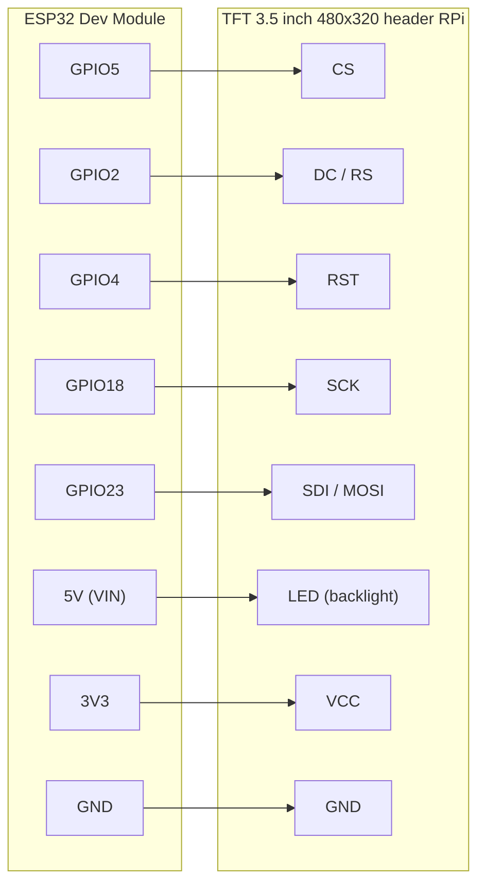
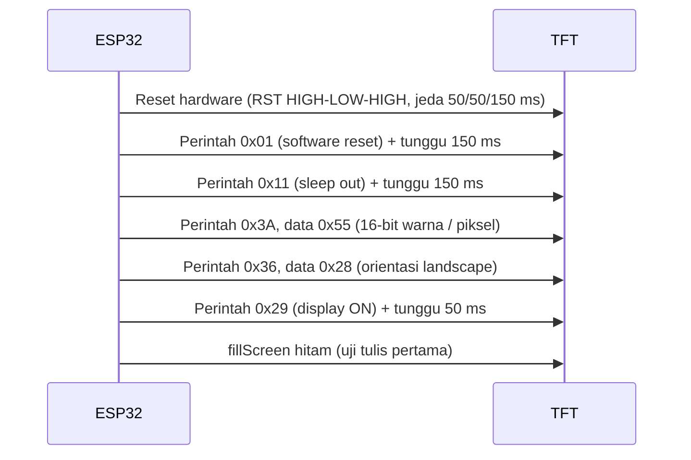

# RH — Wiring Display TFT 3.5" (header RPi) ke ESP32

Dokumen ini khusus membahas sambungan **layar TFT 3.5" 480×320** yang memakai
tata letak pin ala Raspberry Pi (header 26/40-pin, kontroler seri ILI948x/
XPT2046) ke ESP32 Dev Module. Pin dan urutan inisialisasi di sini **identik**
dengan `AB_test_fullscreen.ino` — sketch tes yang sudah terbukti membuat
layar ini menyala dengan benar — supaya wiring tidak perlu ditebak ulang.

> Firmware ini menulis layar lewat SPI mentah (`RH_Tft.cpp`), **bukan**
> library TFT_eSPI. Header pin fisik di board display boleh berlabel
> "RPi", tapi yang dipakai di sini hanya 5 jalur SPI + power — bukan
> protokol khusus Raspberry Pi.

---

## 1. Kenapa cuma 5 pin data, padahal headernya 26/40 pin?

Header RPi di board TFT ini menyediakan banyak pin supaya cocok dipasang
langsung ke GPIO Raspberry Pi (yang pin-nya sudah tetap posisinya). Untuk
ESP32, kita **tidak menancap ke header itu langsung** — kita kabel manual
5 jalur SPI + power dari pin yang relevan di header tersebut ke GPIO ESP32
pilihan kita. Pin touchscreen (XPT2046: T_CLK/T_CS/T_DIN/T_DO/T_IRQ) dan
pin SD card di header **tidak dipakai** oleh firmware ini.

---

## 2. Tabel wiring

| Fungsi header TFT | GPIO ESP32 | Arah | Wajib? |
|---|---|---|---|
| **CS** (LCD chip-select) | **GPIO5** | ESP32 → TFT | Ya |
| **DC** / RS (data/command) | **GPIO2** | ESP32 → TFT | Ya |
| **RST** (reset) | **GPIO4** | ESP32 → TFT | Ya |
| **SCK** (SPI clock) | **GPIO18** | ESP32 → TFT | Ya |
| **SDI / MOSI** (SPI data in) | **GPIO23** | ESP32 → TFT | Ya |
| **SDO / MISO** (SPI data out) | — tidak disambung | — | Tidak (layar hanya ditulis, tidak dibaca) |
| **LED** (backlight) | 3.3V langsung, atau GPIO bebas kalau mau diatur PWM | ESP32/5V → TFT | Ya (lihat §4) |
| **VCC** (logic) | 3.3V | 3.3V → TFT | Ya |
| **GND** | GND | — | Ya |
| **5V** (kalau header punya pin 5V terpisah) | 5V | 5V → TFT | Ya, kalau ada |
| T_CLK, T_CS, T_DIN, T_DO, T_IRQ (touch) | tidak disambung | — | Tidak, firmware tidak pakai touch |
| SD_CS, SD_MOSI, SD_MISO, SD_SCK | tidak disambung | — | Tidak, firmware tidak pakai slot SD |

Kelima pin SPI di atas bisa diubah bebas — bukan pin SPI hardware bawaan
(VSPI/HSPI) — karena `RH_Tft.cpp` memanggil:

```cpp
SPI.begin(HR_PIN_TFT_SCLK, -1, HR_PIN_TFT_MOSI, HR_PIN_TFT_CS);
```

Kalau mau pindah pin, ubah 5 baris `#define HR_PIN_TFT_*` di `RH_Config.h`,
tidak perlu ubah file lain.

```c
// RH_Config.h
#define HR_PIN_TFT_CS     5
#define HR_PIN_TFT_DC     2
#define HR_PIN_TFT_RST    4
#define HR_PIN_TFT_SCLK   18
#define HR_PIN_TFT_MOSI   23
```

---

## 3. Diagram sambungan



---

## 4. Backlight (pin LED)

Cara paling sederhana: sambung **LED langsung ke 3.3V** (lewat header,
biasanya sudah ada resistor pembatas di board TFT-nya). Layar akan selalu
menyala penuh — ini yang diasumsikan firmware saat ini (tidak ada kontrol
backlight di kode).

Kalau board TFT-mu **tidak** punya resistor pembatas di jalur LED dan kamu
menyambung langsung ke 3.3V/5V tanpa resistor, backlight bisa cepat rusak
atau menarik arus berlebihan. Cek dulu datasheet/silkscreen board-mu. Kalau
ragu, pasang resistor 100–220Ω seri ke jalur LED.

Firmware ini **tidak mengatur backlight lewat GPIO**. Kalau nanti mau
ditambah kontrol on/off atau dim PWM, pin LED perlu dipindah ke GPIO bebas
(bukan 3.3V langsung) — beri tahu saya kalau mau fitur ini ditambahkan.

---

## 5. Catatan kelistrikan pin display

| Pin | Catatan |
|---|---|
| **GPIO2 (DC)** | Strapping pin ESP32 (memengaruhi mode boot). Firmware ini sudah menguji pin ini aman dipakai untuk DC, tapi kalau board-mu punya masalah sering gagal boot / gagal upload, coba lepas dulu sambungan ke GPIO2 saat mengupload, lalu sambung lagi setelah upload selesai. |
| **GPIO5 (CS)** | Juga strapping pin, tapi lebih toleran dari GPIO2. Biasanya aman. |
| **GPIO18 (SCK), GPIO23 (MOSI)** | Pin SPI standar, tidak ada pembatasan khusus. |
| **GPIO4 (RST)** | Pin biasa, aman. |
| **VCC logic vs LED** | VCC logic ke **3.3V**. Jalur LED (backlight) pada sebagian besar board TFT 3.5" butuh **5V** untuk kecerahan penuh — cek label di board-mu; kalau salah, layar tetap menyala tapi redup atau backlight tidak nyala sama sekali. |

---

## 6. Kebutuhan daya

Backlight panel 3.5" ini menarik kurang lebih **150 mA** dari jalur 5V saat
menyala penuh, di luar arus ESP32 dan sensor lain. Kalau ESP32 hanya
disuplai dari port USB laptop (sering dibatasi ~500 mA total), layar bisa
tampak redup, berkedip, atau ESP32 restart sendiri saat WiFi aktif
bersamaan dengan layar menyala. **Gunakan adaptor 5V 2A terpisah** yang
disambung ke pin 5V/VIN ESP32, jangan mengandalkan port USB laptop untuk
pemakaian jangka panjang.

---

## 7. Urutan inisialisasi (referensi, sudah ada di firmware)

Ini bukan langkah yang perlu kamu lakukan manual — hanya referensi supaya
kalau layar tidak menyala, kamu tahu urutan mana yang harus dicek di kode
(`RH_Tft.cpp`, fungsi `begin()`):



SPI berjalan di **20 MHz, mode 0, MSB first**.

---

## 8. Troubleshooting cepat

| Gejala | Kemungkinan penyebab | Yang perlu dicek |
|---|---|---|
| Layar mati total, backlight juga mati | Tidak ada daya / salah polaritas | Ukur tegangan di pin VCC dan LED board TFT |
| Backlight nyala, layar putih/hitam polos, tidak ada gambar | SPI data/CS/DC salah sambung, atau firmware belum jalan | Cek 5 pin SPI satu per satu, coba upload ulang `AB_test_fullscreen.ino` |
| Gambar muncul tapi warna terbalik/aneh | MADCTL atau COLMOD berbeda dari panel | Bandingkan dengan hasil `AB_test_fullscreen.ino`; kalau tes itu juga aneh, ini urusan panel bukan firmware |
| ESP32 gagal masuk mode upload saat kabel terpasang | GPIO2 (strapping pin) tertahan oleh rangkaian TFT | Cabut sementara kabel DC (GPIO2) saat upload, pasang lagi setelahnya |
| Layar redup / berkedip saat WiFi aktif | Suplai daya kurang | Pindah ke adaptor 5V 2A eksternal, jangan dari USB laptop |
