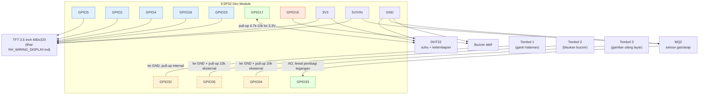
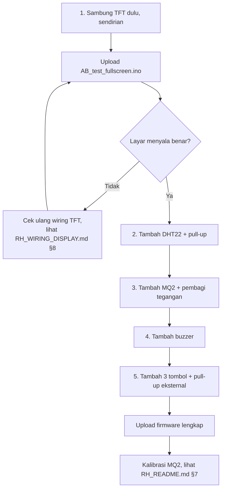

# RH — Wiring Keseluruhan Sistem (ESP32 Server Room Monitor)

Dokumen ini memetakan **semua** komponen dalam satu sistem: display TFT,
sensor DHT22, sensor gas MQ2, buzzer, dan 3 tombol panel. Untuk detail
khusus layar (kenapa pin itu, urutan init, troubleshooting layar), lihat
`RH_WIRING_DISPLAY.md`. Semua pin bersumber dari `RH_Config.h` — kalau kamu
mengubah pin di sana, dokumen ini perlu diperbarui juga.

Board yang diasumsikan: **ESP32 Dev Module** (30-pin, dua baris header).

---

## 1. Peta pin lengkap

| Komponen | Pin ESP32 | Jenis pin | Wajib komponen tambahan |
|---|---|---|---|
| TFT CS | GPIO5 | Output, strapping | — |
| TFT DC | GPIO2 | Output, strapping | — |
| TFT RST | GPIO4 | Output | — |
| TFT SCLK | GPIO18 | Output (SPI clock) | — |
| TFT MOSI | GPIO23 | Output (SPI data) | — |
| DHT22 DATA | GPIO17 | Input/Output (1-wire) | Resistor pull-up 4.7k–10k ke 3.3V |
| MQ2 AO | GPIO33 | Analog input (ADC1_CH5) | **Pembagi tegangan** (lihat §3) |
| Buzzer | GPIO16 | Output (PWM/LEDC) | — |
| Tombol 1 | GPIO32 | Input, pull-up internal aktif | — |
| Tombol 2 | GPIO35 | Input **input-only** | **Pull-up eksternal 10k wajib** |
| Tombol 3 | GPIO34 | Input **input-only** | **Pull-up eksternal 10k wajib** |

Tiga pin di atas (GPIO34, 35, 36, 39) memang tidak punya pull-up/pull-down
internal di hardware ESP32 — ini bukan bug firmware, jadi tombol 2 dan 3
tidak bisa memakai `INPUT_PULLUP` seperti tombol 1.

---

## 2. Diagram sambungan keseluruhan



---

## 3. Rangkaian pendukung wajib

### a. Pembagi tegangan MQ2 (GPIO33)

MQ2 disuplai 5V dan pin AO-nya ikut mengacu ke 5V, sementara ADC ESP32
maksimal aman di 3.3V. **Tanpa pembagi ini, ADC ESP32 berisiko rusak**
saat kadar gas tinggi mendorong AO mendekati 5V penuh.

```
MQ2 AO ──────┬──[ R1 = 10kΩ ]──── GPIO33
             │
          [ R2 = 20kΩ ]
             │
            GND
```

Perhitungan: `Vout = Vin × R2/(R1+R2) = 5V × 20/30 ≈ 3.33V` — aman untuk
ADC ESP32 bahkan saat AO mentok 5V.

### b. Pull-up eksternal tombol 2 & 3 (GPIO35, GPIO34)

```
3.3V ──[ 10kΩ ]──┬──── GPIO35 (atau GPIO34)
                  │
                [ Tombol ]
                  │
                 GND
```

Saat tombol tidak ditekan: GPIO terbaca **HIGH** (ditarik oleh resistor).
Saat ditekan: GPIO terbaca **LOW** (terhubung ke GND). Ini sesuai
`HR_BTN_ACTIVE_LOW = 1` di `RH_Config.h`.

### c. Tombol 1 (GPIO32) — tidak perlu resistor tambahan

Firmware mengaktifkan `INPUT_PULLUP` internal ESP32 untuk pin ini, jadi
tombolnya cukup dipasang antara **GPIO32 dan GND** langsung, tanpa
komponen tambahan.

### d. Pull-up DHT22 (GPIO17)

Sebagian modul DHT22 versi 3-pin (dengan PCB breakout) sudah menyertakan
resistor pull-up ini di papannya. Kalau kamu pakai sensor DHT22 telanjang
(4 pin, tanpa breakout), tambahkan resistor 4.7k–10kΩ dari pin DATA ke
3.3V secara manual.

---

## 4. Tabel referensi cepat semua komponen

| Komponen | VCC | GND | Sinyal | Catatan daya |
|---|---|---|---|---|
| TFT 3.5" | 3.3V (logic) + 5V (backlight, kalau ada pin terpisah) | GND | 5× GPIO (lihat `RH_WIRING_DISPLAY.md`) | ~150 mA saat backlight menyala |
| DHT22 | 3.3V | GND | GPIO17 | Baca minimal tiap 2 detik (batas sensor) |
| MQ2 | **5V** (heater butuh ini) | GND | GPIO33 lewat pembagi tegangan | Heater menarik ~150 mA, perlu pemanasan 30 detik–24 jam |
| Buzzer aktif | — (langsung dari GPIO) | GND | GPIO16 | `HR_BUZZER_IS_ACTIVE=1`: GPIO HIGH/LOW langsung |
| Tombol 1/2/3 | — | GND | GPIO32/35/34 | Aktif LOW (ditekan = LOW) |

---

## 5. Total kebutuhan daya & rekomendasi suplai

| Beban | Perkiraan arus |
|---|---|
| ESP32 (WiFi aktif) | ~160–240 mA (puncak saat transmit bisa lebih tinggi) |
| Backlight TFT 3.5" | ~150 mA |
| MQ2 heater | ~150 mA |
| DHT22, buzzer, tombol | < 10 mA gabungan |
| **Total puncak** | **~500–550 mA** |

Port USB laptop/PC standar sering membatasi total ~500 mA, jadi untuk
pemakaian yang stabil dan jangka panjang, **pakai adaptor 5V minimal 2A**
ke pin 5V/VIN ESP32, bukan mengandalkan USB komputer.

---

## 6. Urutan perakitan yang disarankan



Memasang satu-satu dan menguji bertahap jauh lebih mudah dilacak
dibanding merakit semua sekaligus lalu bingung komponen mana yang
bermasalah saat sistem tidak jalan.

---

## 7. Kesalahan wiring yang sering terjadi

| Kesalahan | Akibat |
|---|---|
| MQ2 AO langsung ke GPIO tanpa pembagi tegangan | ADC ESP32 berisiko rusak permanen saat gas tinggi |
| Tombol 2/3 tanpa pull-up eksternal | Pin mengambang, tombol terbaca "ditekan sendiri" karena noise |
| DHT22 dan MQ2 berbagi jalur 5V dengan backlight TFT tanpa suplai memadai | Brownout / ESP32 restart sendiri saat semua aktif bersamaan |
| Tertukar CS/DC pada TFT | Layar tidak menyala atau tampil acak |
| Lupa GND bersama (common ground) antara ESP32 dan modul eksternal | Pembacaan sensor tidak stabil atau data ngaco |

Pastikan **semua GND** (ESP32, TFT, DHT22, MQ2, buzzer, adaptor eksternal
kalau ada) tersambung ke satu titik referensi yang sama.
