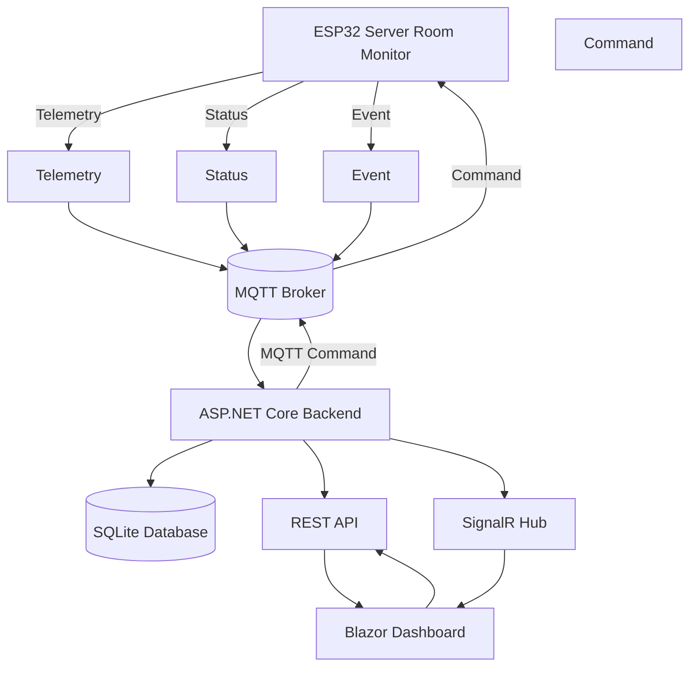
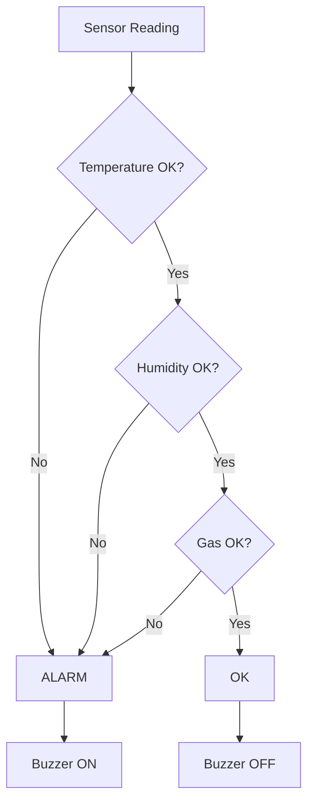
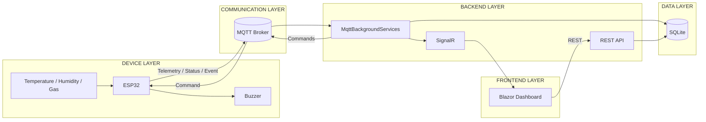

# HR Server Monitoring
## API & System Documentation

---

## 1. Overview

**HR Server Monitoring** adalah sistem monitoring ruang server berbasis ESP32.

Sistem terdiri dari:

- ESP32 sebagai sensor/device
- MQTT Broker sebagai komunikasi device
- ASP.NET Core sebagai backend
- SQLite sebagai database
- SignalR sebagai komunikasi realtime
- Blazor Dashboard sebagai antarmuka monitoring

### Architecture



---

# 2. System Configuration

| Component | Configuration |
|---|---|
| Backend | ASP.NET Core 8 |
| Backend URL | `http://localhost:5186` |
| Database | SQLite |
| Database file | `sensordata.db` |
| MQTT Broker | `192.16x.xx.xxx:1883` |
| Device ID | `srv-room-01` |
| Device Location | `Ruang Server Lt.1` |
| Firmware | `1.0.0` |
| SignalR Hub | `/sensorhub` |

---

# 3. Communication Architecture

Terdapat tiga jalur komunikasi utama.

```text
                    ┌─────────────────┐
                    │     ESP32       │
                    └────────┬────────┘
                             │
                             │ MQTT
                             ▼
                    ┌─────────────────┐
                    │  MQTT Broker    │
                    └────────┬────────┘
                             │
                             │ MQTT
                             ▼
                    ┌─────────────────┐
                    │ ASP.NET Core    │
                    │    Backend      │
                    └────┬───────┬────┘
                         │       │
                       REST   SignalR
                         │       │
                         ▼       ▼
                    ┌─────────────────┐
                    │    Dashboard    │
                    └─────────────────┘
```

### Fungsi masing-masing

| Interface | Fungsi |
|---|---|
| MQTT | Komunikasi ESP32 ↔ Backend |
| REST API | Request/response Dashboard ↔ Backend |
| SignalR | Update realtime Backend → Dashboard |
| SQLite | Penyimpanan data |

---

# 4. REST API

Base URL:

```text
http://localhost:5186
```

---

# 5. Sensor Data API

## GET `/api/SensorData`

Mengambil data sensor yang tersimpan di database.

### Request

```http
GET /api/SensorData
```

### Contoh

```text
GET http://localhost:5186/api/SensorData
```

### Response

```json
[
  {
    "id": 1,
    "deviceId": "srv-room-01",
    "gasLevel": 16,
    "temperature": 23.5,
    "humidity": 49.5,
    "timestamp": "2026-09-25T01:00:00Z"
  }
]
```

### Field

| Field | Type | Keterangan |
|---|---|---|
| `id` | integer | ID database |
| `deviceId` | string | ID device |
| `gasLevel` | number | Level gas |
| `temperature` | number | Temperatur °C |
| `humidity` | number | Kelembapan % |
| `timestamp` | datetime | Waktu data |

---

# 6. POST `/api/SensorData`

Menyimpan data sensor ke database.

### Request

```http
POST /api/SensorData
Content-Type: application/json
```

### Body

```json
{
  "deviceId": "srv-room-01",
  "gasLevel": 16,
  "temperature": 23.5,
  "humidity": 49.5,
  "timestamp": "2026-09-25T01:00:00Z"
}
```

---

# 7. Device API

## GET `/api/Device`

Mengambil informasi device yang diketahui oleh backend.

### Request

```http
GET /api/Device
```

### Contoh

```text
GET http://localhost:5186/api/Device
```

---

# 8. Device Status

Status koneksi device berasal dari MQTT topic:

```text
serverroom/<device_id>/status
```

Untuk device utama:

```text
serverroom/srv-room-01/status
```

Payload yang digunakan:

```text
online
```

atau:

```text
offline
```

### Arti status

```text
ONLINE
    =
ESP32 terhubung ke MQTT

OFFLINE
    =
ESP32 tidak terhubung ke MQTT
```

### Catatan penting

Status koneksi **berbeda** dengan status sensor.

Contoh:

```json
{
  "status": "alarm"
}
```

pada telemetry berarti kondisi sensor alarm.

Bukan berarti:

```text
MQTT connection = OFFLINE
```

---

# 9. Threshold API

Threshold digunakan untuk menentukan apakah nilai sensor masih berada dalam monitoring range.

---

## GET `/api/Threshold`

Mengambil threshold saat ini.

### Request

```http
GET /api/Threshold
```

### Contoh

```text
GET http://localhost:5186/api/Threshold
```

Jika database belum mempunyai threshold, backend membuat default:

```text
Temperature:
20 - 30 °C

Humidity:
40 - 70 %

Gas:
0 - 50
```

### Response

```json
{
  "id": 1,
  "temperatureMin": 20,
  "temperatureMax": 30,
  "humidityMin": 40,
  "humidityMax": 70,
  "gasLevelMin": 0,
  "gasLevelMax": 50
}
```

---

# 10. PUT `/api/Threshold`

Mengubah threshold monitoring.

### Request

```http
PUT /api/Threshold
Content-Type: application/json
```

### Body

```json
{
  "temperatureMin": 20,
  "temperatureMax": 30,
  "humidityMin": 40,
  "humidityMax": 70,
  "gasLevelMin": 0,
  "gasLevelMax": 50
}
```

---

## Validation

Backend memvalidasi:

```text
TemperatureMin < TemperatureMax
```

```text
HumidityMin < HumidityMax
```

```text
GasLevelMin < GasLevelMax
```

Jika tidak valid:

```http
400 Bad Request
```

Contoh:

```text
Temperature minimum harus lebih kecil dari maximum.
```

---

# 11. Proses PUT Threshold

Ketika user mengubah threshold melalui dashboard:

```text
Dashboard
    │
    │ PUT /api/Threshold
    ▼
ASP.NET Core
    │
    ├───────────────┐
    ▼               ▼
SQLite          MQTT Command
                    │
                    ▼
                  ESP32
```

Backend melakukan:

1. Validasi input
2. Update database
3. Mengirim command MQTT
4. Membuat `DeviceEvent`
5. Mengembalikan hasil ke dashboard

### Response

```json
{
  "threshold": {
    "id": 1,
    "temperatureMin": 20,
    "temperatureMax": 30,
    "humidityMin": 40,
    "humidityMax": 70,
    "gasLevelMin": 0,
    "gasLevelMax": 50
  },
  "esp32CommandSent": true
}
```

### `esp32CommandSent`

```text
true
```

berarti backend berhasil melakukan publish MQTT.

```text
false
```

berarti command belum dapat dikirim karena MQTT/device belum terhubung.

### Penting

`esp32CommandSent = true` **bukan command acknowledgement dari ESP32**.

Sistem saat ini belum mempunyai ACK command.

---

# 12. Threshold Synchronization

Jika ESP32 offline ketika threshold diubah:

```text
Dashboard
    │
    ▼
Backend
    │
    ├── Save threshold
    │
    └── MQTT unavailable
             │
             ▼
        Command belum terkirim
```

Ketika ESP32 kembali online:

```text
ESP32
   │
   │ status = online
   ▼
MQTT Broker
   │
   ▼
Backend
   │
   │ baca threshold database
   ▼
Publish set_threshold
   │
   ▼
ESP32
```

Dengan demikian threshold database dapat disinkronkan kembali ke device setelah device reconnect.

---

# 13. Device Events API

## GET `/api/DeviceEvents`

Mengambil event/log device.

### Request

```http
GET /api/DeviceEvents
```

### Contoh

```text
GET http://localhost:5186/api/DeviceEvents
```

Backend mengambil maksimal 100 event terbaru.

### Response

```json
[
  {
    "id": 35,
    "deviceId": "srv-room-01",
    "eventType": "threshold",
    "fromLevel": "out_of_range",
    "toLevel": "in_range",
    "message": "Semua sensor kembali ke dalam monitoring range.",
    "timestamp": "2026-09-25T01:10:00Z"
  }
]
```

---

# 14. DeviceEvent Model

```text
DeviceEvent
├── Id
├── DeviceId
├── EventType
├── FromLevel
├── ToLevel
├── Message
└── Timestamp
```

### Field

| Field | Type | Keterangan |
|---|---|---|
| `id` | integer | ID event |
| `deviceId` | string | Device sumber event |
| `eventType` | string | Jenis event |
| `fromLevel` | string/null | Level sebelumnya |
| `toLevel` | string/null | Level baru |
| `message` | string/null | Deskripsi event |
| `timestamp` | datetime | Waktu event |

---

# 15. Event Types

Event yang digunakan sistem antara lain:

### `connection`

Menandakan perubahan koneksi device.

Contoh:

```text
offline → online
```

atau:

```text
online → offline
```

---

### `level_change`

Menandakan perubahan overall level sensor dari firmware.

Contoh:

```text
ok → alarm
```

atau:

```text
alarm → ok
```

---

### `threshold`

Menandakan perubahan kondisi monitoring threshold.

Contoh:

```text
in_range → out_of_range
```

atau:

```text
out_of_range → in_range
```

---

### `threshold_update`

Menandakan threshold diubah melalui dashboard/API.

---

# 16. Device Log pada Dashboard

Dashboard tidak perlu menampilkan seluruh event dari semua device.

Konsep filtering:

```text
User klik Device
       │
       ▼
Ambil DeviceEvents
       │
       ▼
Filter DeviceId
       │
       ▼
Tampilkan log device tersebut
```

Contoh:

```text
Selected Device:

srv-room-01
```

Maka hanya:

```text
DeviceEvent.DeviceId == "srv-room-01"
```

yang ditampilkan.

---

# 17. SignalR

SignalR Hub:

```text
/sensorhub
```

Full URL:

```text
http://localhost:5186/sensorhub
```

SignalR digunakan untuk update realtime tanpa dashboard harus melakukan polling terus-menerus.

---

## Realtime Sensor Data

Event:

```text
ReceiveSensorData
```

Digunakan untuk mengirim data sensor baru ke dashboard.

---

## Realtime MQTT Telemetry

Event:

```text
ReceiveMqttTelemetry
```

Digunakan untuk mengirim telemetry MQTT ke dashboard.

---

## Realtime Device Status

Event:

```text
ReceiveDeviceStatus
```

Digunakan untuk memperbarui status device pada dashboard.

---

# 18. MQTT Architecture

MQTT Base Topic:

```text
serverroom/<device_id>
```

Untuk device:

```text
srv-room-01
```

base topic menjadi:

```text
serverroom/srv-room-01
```

Topic lengkap:

```text
serverroom/srv-room-01/telemetry
serverroom/srv-room-01/status
serverroom/srv-room-01/event
serverroom/srv-room-01/cmd
```

---

# 19. MQTT Telemetry

Topic:

```text
serverroom/srv-room-01/telemetry
```

Direction:

```text
ESP32 → MQTT Broker → Backend
```

QoS:

```text
0
```

Retained:

```text
No
```

### Payload

```json
{
  "device_id": "srv-room-01",
  "location": "Ruang Server Lt.1",
  "fw": "1.0.0",
  "uptime_s": 680,
  "age_ms": 0,
  "temp_c": 23.5,
  "hum_pct": 49.5,
  "gas_raw": 656,
  "gas_pct": 16.0,
  "level": {
    "temp": "ok",
    "hum": "ok",
    "gas": "ok"
  },
  "status": "ok",
  "rssi": -45
}
```

---

# 20. Telemetry Fields

| Field | Type | Keterangan |
|---|---|---|
| `device_id` | string | ID ESP32 |
| `location` | string | Lokasi device |
| `fw` | string | Firmware version |
| `uptime_s` | integer | ESP32 uptime |
| `age_ms` | integer | Umur telemetry |
| `temp_c` | number/null | Temperatur |
| `hum_pct` | number/null | Humidity |
| `gas_raw` | integer/null | Raw gas sensor |
| `gas_pct` | number/null | Gas percentage |
| `level.temp` | string | Temperature level |
| `level.hum` | string | Humidity level |
| `level.gas` | string | Gas level |
| `status` | string | Overall sensor level |
| `rssi` | integer | Wi-Fi RSSI |

---

# 21. Telemetry Frequency

ESP32 mengirim telemetry:

```text
setiap 10 detik
```

Telemetry juga dikirim segera ketika:

```text
overall sensor level berubah
```

Contoh:

```text
OK
 ↓
ALARM
```

atau:

```text
ALARM
 ↓
OK
```

---

# 22. MQTT Status

Topic:

```text
serverroom/srv-room-01/status
```

Direction:

```text
ESP32 → MQTT Broker → Backend
```

Payload:

```text
online
```

atau:

```text
offline
```

Status topic menggunakan retained message.

ESP32 juga menggunakan MQTT Last Will untuk kondisi:

```text
offline
```

---

# 23. MQTT Event

Topic:

```text
serverroom/srv-room-01/event
```

Direction:

```text
ESP32 → MQTT Broker → Backend
```

Payload:

```json
{
  "device_id": "srv-room-01",
  "what": "level_change",
  "from": "ok",
  "to": "alarm",
  "uptime_s": 3600
}
```

Event dikirim ketika overall sensor level berubah.

Backend dapat menyimpannya sebagai:

```text
DeviceEvent
```

---

# 24. MQTT Command

Topic:

```text
serverroom/srv-room-01/cmd
```

Direction:

```text
Backend → MQTT Broker → ESP32
```

QoS:

```text
0
```

Retained:

```text
No
```

Command yang digunakan antara lain:

```text
set_threshold
mute
unmute
reboot
```

---

# 25. Set Threshold Command

Payload:

```json
{
  "command": "set_threshold",
  "temperature_min": 20,
  "temperature_max": 30,
  "humidity_min": 40,
  "humidity_max": 70,
  "gas_min": 0,
  "gas_max": 50
}
```

Alur:

```text
Dashboard
    │
    ▼
PUT /api/Threshold
    │
    ▼
Backend
    │
    ▼
MQTT
    │
    ▼
ESP32
```

ESP32 kemudian menggunakan threshold tersebut untuk evaluasi kondisi sensor.

---

# 26. Mute Command

Payload:

```text
mute
```

Direction:

```text
Backend → MQTT → ESP32
```

Efek:

```text
Buzzer OFF
```

meskipun kondisi alarm masih aktif.

---

# 27. Unmute Command

Payload:

```text
unmute
```

Efek:

```text
Buzzer kembali mengikuti kondisi alarm.
```

Firmware menggunakan exact command comparison untuk membedakan:

```text
mute
```

dan:

```text
unmute
```

---

# 28. Reboot Command

Payload:

```text
reboot
```

Efek:

```text
ESP32 restart
```

---

# 29. Sensor Threshold Logic

Threshold menggunakan range:

```text
MIN <= VALUE <= MAX
```

### Temperature

```text
temperatureMin
        <=
temperature
        <=
temperatureMax
```

### Humidity

```text
humidityMin
      <=
humidity
      <=
humidityMax
```

### Gas

```text
gasLevelMin
      <=
gasLevel
      <=
gasLevelMax
```

---

# 30. Overall Monitoring State

Semua sensor harus berada dalam range:

```text
Temperature OK
      AND
Humidity OK
      AND
Gas OK
      │
      ▼
IN RANGE
```

Jika salah satu sensor keluar:

```text
Temperature OUT
       OR
Humidity OUT
       OR
Gas OUT
       │
       ▼
OUT OF RANGE
```

---

# 31. Alarm Flow



Mute:

```text
ALARM
  │
  ▼
MUTED
  │
  ▼
Buzzer OFF
```

Unmute:

```text
UNMUTE
  │
  ▼
Evaluasi alarm kembali
```

---

# 32. Database

Database:

```text
sensordata.db
```

Entity utama:

```text
SensorData
SensorThreshold
DeviceEvent
```

---

## SensorData

```text
Id
DeviceId
GasLevel
Temperature
Humidity
Timestamp
```

---

## SensorThreshold

```text
Id
TemperatureMin
TemperatureMax
HumidityMin
HumidityMax
GasLevelMin
GasLevelMax
```

---

## DeviceEvent

```text
Id
DeviceId
EventType
FromLevel
ToLevel
Message
Timestamp
```

---

# 33. API Summary

| Method | Endpoint | Fungsi |
|---|---|---|
| GET | `/api/SensorData` | Mengambil data sensor |
| POST | `/api/SensorData` | Menyimpan data sensor |
| GET | `/api/Device` | Mengambil device |
| GET | `/api/Threshold` | Mengambil threshold |
| PUT | `/api/Threshold` | Mengubah threshold |
| GET | `/api/DeviceEvents` | Mengambil event/log |
| GET | `/sensorhub` | SignalR Hub |

---

# 34. Communication Summary

```text
ESP32 → MQTT → Backend

Backend → SQLite
Backend → SignalR → Dashboard

Dashboard → REST API → Backend

Backend → MQTT → ESP32
```

---

# 35. Quick Testing

## Sensor Data

```powershell
Invoke-RestMethod `
    http://localhost:5186/api/SensorData
```

---

## Device

```powershell
Invoke-RestMethod `
    http://localhost:5186/api/Device
```

---

## Threshold

```powershell
Invoke-RestMethod `
    http://localhost:5186/api/Threshold
```

---

## Device Events

```powershell
Invoke-RestMethod `
    http://localhost:5186/api/DeviceEvents
```

---

# 36. Example Threshold Test

Mengubah maximum temperature menjadi 25°C:

```powershell
$body = @{
    temperatureMin = 20
    temperatureMax = 25
    humidityMin = 40
    humidityMax = 70
    gasLevelMin = 0
    gasLevelMax = 50
} | ConvertTo-Json

Invoke-RestMethod `
    -Uri "http://localhost:5186/api/Threshold" `
    -Method Put `
    -ContentType "application/json" `
    -Body $body
```

Jika temperatur ESP32 saat ini:

```text
27°C
```

maka temperatur berada di luar monitoring range.

Expected:

```text
Temperature = OUT OF RANGE
Overall      = ALARM
Buzzer       = ON
```

Jika threshold kemudian dinaikkan menjadi:

```text
Temperature Max = 30°C
```

dan temperatur:

```text
27°C
```

maka:

```text
Temperature = OK
Overall      = OK
Buzzer       = OFF
```

---

# 37. Device Recovery Flow

Ketika ESP32 kehilangan koneksi:

```text
ESP32
  │
  X
MQTT
  │
  ▼
Backend
  │
  ▼
Device = OFFLINE
```

Ketika ESP32 kembali:

```text
ESP32
  │
  ▼
MQTT CONNECT
  │
  ▼
status = online
  │
  ▼
Backend
  │
  ├── Device = ONLINE
  │
  └── Sync Threshold
          │
          ▼
       ESP32
```

---

# 38. Important Distinctions

### Connection status

```text
serverroom/srv-room-01/status
```

Menunjukkan:

```text
ONLINE / OFFLINE
```

### Sensor status

```json
"status": "ok"
```

atau:

```json
"status": "alarm"
```

Menunjukkan kondisi sensor.

### Device event

```text
DeviceEvent
```

Menyimpan kejadian penting untuk histori/log.

### Telemetry

```text
telemetry
```

Berisi nilai sensor realtime dari ESP32.

---

# 39. Current System Limitations

## Authentication

REST API saat ini belum menggunakan authentication/authorization.

## MQTT Security

Konfigurasi MQTT saat ini belum menggunakan authentication/TLS.

## Command ACK

Belum ada acknowledgement command dari ESP32.

```text
Backend publish command
        ≠
ESP32 confirmed command
```

## MQTT QoS

Command menggunakan QoS 0.

## Device Timestamp

Telemetry menggunakan:

```text
uptime_s
age_ms
```

bukan absolute timestamp dari ESP32.

## Mute State

State mute belum dipublikasikan sebagai MQTT state khusus.

---

# 40. Recommended Production Improvements

Untuk deployment production, sistem dapat dikembangkan dengan:

1. Authentication
2. Authorization / role management
3. MQTT username/password
4. MQTT TLS
5. Command acknowledgement
6. QoS yang sesuai untuk command
7. Device registry
8. Event pagination
9. Sensor history filtering
10. Structured logging
11. Health check endpoint
12. API versioning
13. Rate limiting
14. Configuration melalui `appsettings.json`
15. Automated unit/integration tests

---

# 41. Final Architecture



---

# 42. System Summary

HR Server Monitoring menggunakan arsitektur:

```text
ESP32
  ↓
MQTT
  ↓
ASP.NET Core
  ├── REST API
  ├── SignalR
  └── SQLite
  ↓
Blazor Dashboard
```

MQTT menangani komunikasi device.

REST API menangani request/response.

SignalR menangani update realtime.

SQLite menyimpan data dan event.

Dashboard digunakan untuk:

- Melihat status device
- Melihat temperatur
- Melihat humidity
- Melihat gas level
- Mengubah monitoring threshold
- Mengirim command
- Melihat device log
- Memantau kondisi alarm secara realtime

Sistem juga mendukung:

```text
Dynamic Threshold
MQTT Device Status
Realtime Telemetry
Realtime Device Event
Buzzer Alarm
Mute / Unmute
ESP32 Reconnect
Threshold Synchronization
SQLite History
Device-specific Logs
```

---